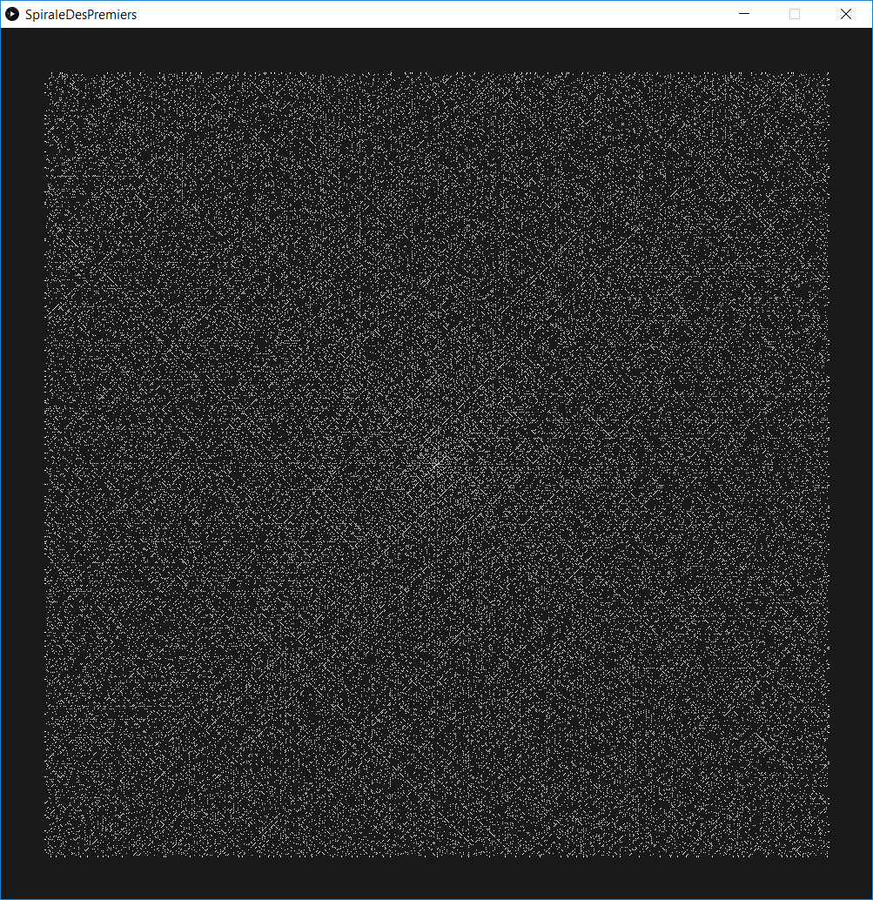

# PrimesSpiral

Draws the integers in a spiral and the prime numbers in a distinct color.

Shows the tendency of primes to allign forming diagonals.

----------------

made by myro_973 - 2017.11

www.instagram.com/myro_973/
